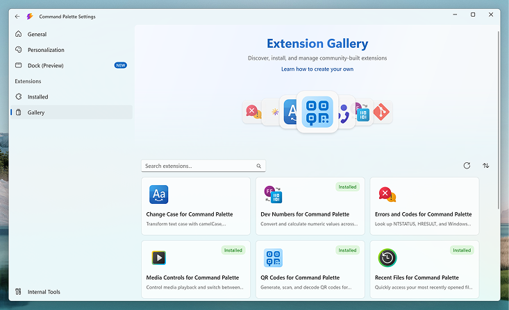
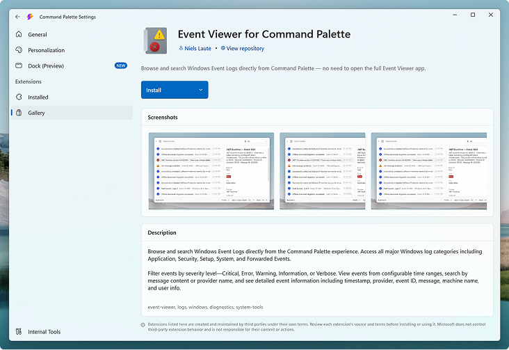

  

<h1 align="center">🎨 Command Palette Extensions Gallery</h1>

  The official community gallery for <a href="https://github.com/microsoft/PowerToys">Command Palette</a> extensions.

<h3 align="center">
  <a href="#-submit-your-extension">Submit an extension</a>
   · 
  <a href="https://learn.microsoft.com/windows/powertoys/command-palette/extensibility-overview">Create your own extension</a>
</h3>

 

🔍 **Discoverable by millions** — your extension shows up right inside Command Palette

📦 **Host it your way** — publish through winget, the Microsoft Store, or your own download link — you stay in control

🌍 **Open-source & community-driven** — join a growing ecosystem of developers extending Windows productivity

 

## 🛠️ Submit your extension

New to building Command Palette extensions? Check out the [Extension Development docs](https://learn.microsoft.com/windows/powertoys/command-palette/extensibility-overview) to get started.

📦 **Host it your way** — publish through winget, the Microsoft Store, or your own download link — you stay in control

🌍 **Open-source & community-driven** — join a growing ecosystem of developers extending Windows productivity

 

## 🛠️ Submit your extension

New to building Command Palette extensions? Check out the [Extension Development docs](https://learn.microsoft.com/windows/powertoys/command-palette/extensibility-overview) to get started.

Once your extension is ready, add it to the gallery by opening a pull request with an `extension.json`, an icon, and at least one install source — winget, Microsoft Store, or a direct download URL. CI validates your submission automatically and the Command Palette team will review your PR.

👉 **[Submit your extension guide](docs/CONTRIBUTING.md)** — full walkthrough, field reference, and a [sample extension](extensions/microsoft/sample-extension/) to get started.

  

 

## 🤝 Contributing

This project welcomes contributions and suggestions. Most contributions require you to agree to a Contributor License Agreement (CLA) declaring that you have the right to, and actually do, grant us the rights to use your contribution. For details, visit the [Microsoft CLA site](https://cla.opensource.microsoft.com).

When you submit a pull request, a CLA bot will automatically determine whether you need to provide a CLA and decorate the PR appropriately (e.g., status check, comment). Simply follow the instructions provided by the bot. You will only need to do this once across all repos using our CLA.

This project has adopted the [Microsoft Open Source Code of Conduct](https://opensource.microsoft.com/codeofconduct/). For more information, see the [Code of Conduct FAQ](https://opensource.microsoft.com/codeofconduct/faq/) or contact [opencode@microsoft.com](mailto:opencode@microsoft.com) with any additional questions or comments.

 

## ⚖️ Trademarks

This project may contain trademarks or logos for projects, products, or services. Authorized use of Microsoft trademarks or logos is subject to and must follow [Microsoft's Trademark & Brand Guidelines](https://www.microsoft.com/legal/intellectualproperty/trademarks/usage/general). Use of Microsoft trademarks or logos in modified versions of this project must not cause confusion or imply Microsoft sponsorship. Any use of third-party trademarks or logos are subject to those third-party's policies.
